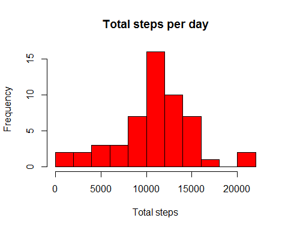
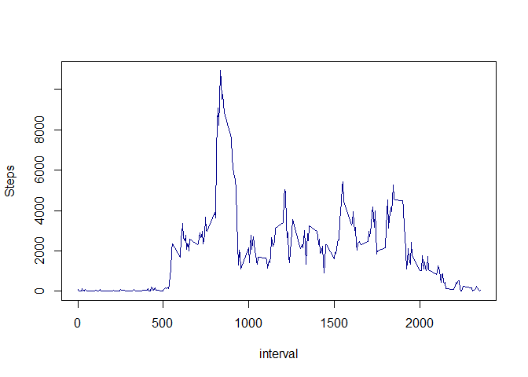
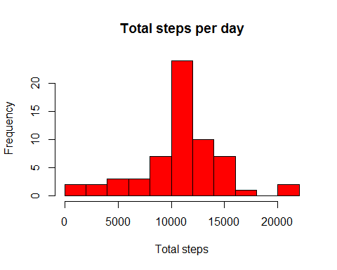
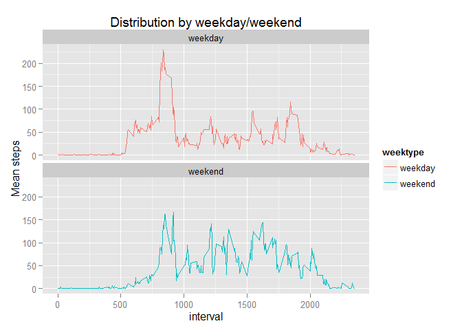

# Reproducible Research: Peer Assessment 1


## Loading and preprocessing the data

Data can be obtained from the following link: [Activity monitoring data](https://d396qusza40orc.cloudfront.net/repdata%2Fdata%2Factivity.zip)

After you've downloaded the data,to load the data into R, enter the following code (to get the sense of the data, use str function): 


```r
rawdata <- read.csv("C:/Users/sbanjeglav/Documents/R_Projects/Reproducible Research/activity.csv")
str(rawdata)
```

```
## 'data.frame':	17568 obs. of  3 variables:
##  $ steps   : int  NA NA NA NA NA NA NA NA NA NA ...
##  $ date    : Factor w/ 61 levels "2012-10-01","2012-10-02",..: 1 1 1 1 1 1 1 1 1 1 ...
##  $ interval: int  0 5 10 15 20 25 30 35 40 45 ...
```

Notice that `date` column is a factor variable. We'll change that: 

```r
rawdata$date <- as.Date(rawdata$date, "%Y-%m-%d")
class(rawdata$date)[1]
```

```
## [1] "Date"
```


## What is mean total number of steps taken per day?

To calculate total number of steps taken per day, we'll use **dplyr** package, and use functions *group_by* and *summarize* in conjunction. 

But before that, we'll filter rawdata in order to remove 'NA' values:


```r
library(dplyr)
data <- filter(rawdata, !is.na(steps))
by_date <- group_by(data, date)
Tot_by_day <- summarize(by_date, Tot_steps_perday = sum(steps))
Tot_by_day
```

```
## Source: local data frame [53 x 2]
## 
##          date Tot_steps_perday
##        (date)            (int)
## 1  2012-10-02              126
## 2  2012-10-03            11352
## 3  2012-10-04            12116
## 4  2012-10-05            13294
## 5  2012-10-06            15420
## 6  2012-10-07            11015
## 7  2012-10-09            12811
## 8  2012-10-10             9900
## 9  2012-10-11            10304
## 10 2012-10-12            17382
## ..        ...              ...
```

To take a look of the frequency of the amount of steps per day, let's take a look at a histogram: 


```r
hist <- hist(Tot_by_day$Tot_steps_perday, col="red", xlab = "Total steps", main = "Total steps per day", breaks = 15)
```

 

To calculate and the mean and median of the total number of steps taken per day, we'll use the following functions: 


```r
meanSteps <- mean(Tot_by_day$Tot_steps_perday)
medianSteps <- median(Tot_by_day$Tot_steps_perday)
meanSteps
```

```
## [1] 10766.19
```

```r
medianSteps
```

```
## [1] 10765
```


## What is the average daily activity pattern?

We'll make a time series plot of the 5-minute interval (x-axis) and the average number of steps taken, averaged across all days (y-axis):


```r
by_int <- group_by(data, interval)
Sum_Int <- summarize(by_int, Steps = sum(steps))
with(Sum_Int, plot(interval, Steps, type="l", col = "dark blue"))
```

 

Let's take a look which 5-minute interval, on average across all the days in the dataset, contains the maximum number of steps!


```r
Sum_Int[which.max(x = Sum_Int$Steps),]
```

```
## Source: local data frame [1 x 2]
## 
##   interval Steps
##      (int) (int)
## 1      835 10927
```

So, the answer is: 835th interval contains the max number of steps. 


## Imputing missing values

Now, let's take a look what is the total number of missing values in our initial dataset:


```r
sum(is.na(rawdata$steps))
```

```
## [1] 2304
```

Instead of simply filtering the NAs out of the dataset, we'll substitute them by mean value for that 5-minute interval.
First, we need to find mean values for every 5-minute interval, and merge original dataset with this one: 


```r
Mean_Int <- summarize(by_int, MeanSteps = mean(steps, na.rm = T))
data1 <- merge(rawdata, Mean_Int, by= "interval", all = T)
```

Now, we'll use a for loop to loop through the column 'steps' and substitute all missing values with the 5-minute mean: 


```r
for( i in seq_len (nrow(data1))) {
    if (is.na(data1$steps[i])){
        data1$steps[i] <- data1$MeanSteps[i]
    }
}

sum(is.na(data1$steps))
```

```
## [1] 0
```

Success! :)
Just to remove MeanSteps column so we can get the original dataset, only without the missing values: 


```r
rawdata1 <- select(data1, 1:3)
```

We'll make a histogram of the total number of steps taken each day and calculate and report the mean and median total number of steps taken per day to inspect if the values ahd changed.


```r
by_date1 <- group_by(rawdata1, date)
Tot_by_day1 <- summarize(by_date1, Tot_steps_perday1 = sum(steps))
hist <- hist(Tot_by_day1$Tot_steps_perday1, col="red", xlab = "Total steps", main = "Total steps per day", breaks = 15)
```

 


```r
meanSteps1 <- mean(Tot_by_day1$Tot_steps_perday1)
medianSteps1 <- median(Tot_by_day1$Tot_steps_perday1)
meanSteps1
```

```
## [1] 10766.19
```

```r
medianSteps1
```

```
## [1] 10766.19
```

Let's take a look at the old values once again: 

```r
meanSteps
```

```
## [1] 10766.19
```

```r
medianSteps
```

```
## [1] 10765
```

Now both mean and median have the same value. 


## Are there differences in activity patterns between weekdays and weekends?

Create new columns to determine whether the given date is a weekday or weekend: 


```r
data1 <- mutate(data1, weekday = weekdays(date))
data1 <- mutate(data1, weektype = ifelse( weekday == "subota" | weekday == "nedjelja" , "weekend", "weekday"))
data1$weektype <- as.factor(data1$weektype)
str(data1)
```

```
## 'data.frame':	17568 obs. of  6 variables:
##  $ interval : int  0 0 0 0 0 0 0 0 0 0 ...
##  $ steps    : num  1.72 0 0 0 0 ...
##  $ date     : Date, format: "2012-10-01" "2012-11-23" ...
##  $ MeanSteps: num  1.72 1.72 1.72 1.72 1.72 ...
##  $ weekday  : chr  "ponedjeljak" "petak" "nedjelja" "utorak" ...
##  $ weektype : Factor w/ 2 levels "weekday","weekend": 1 1 2 1 2 1 2 1 1 2 ...
```

```r
head(data1)
```

```
##   interval    steps       date MeanSteps     weekday weektype
## 1        0 1.716981 2012-10-01  1.716981 ponedjeljak  weekday
## 2        0 0.000000 2012-11-23  1.716981       petak  weekday
## 3        0 0.000000 2012-10-28  1.716981    nedjelja  weekend
## 4        0 0.000000 2012-11-06  1.716981      utorak  weekday
## 5        0 0.000000 2012-11-24  1.716981      subota  weekend
## 6        0 0.000000 2012-11-15  1.716981    četvrtak  weekday
```

Now, we'll apply functions 'group_by' and 'summarize' to prepare the data for plotting: 


```r
int_week <- group_by(data1, interval, weektype)
data2 <- summarize (int_week, Mean_steps = mean(steps))

library(ggplot2)
g <- ggplot(data2, aes(interval, Mean_steps, color = weektype)) + geom_line() + facet_wrap(~weektype, ncol = 1, nrow=2) + labs(title = "Distribution by weekday/weekend") + labs(y="Mean steps")
g
```

 

In conclusion, we can say that there is a difference between activity patterns between weekdays and weekends. 
Test object becomes active more early during the weekdays, with the peak which probably corresponds with the time of going to work.  Also, object is more active at night during the weekends. On the weekend, object is generally more active during the day, with several peaks of pretty much the same intensity. On weekdays, there is one big peak, and several smaller ones. 
